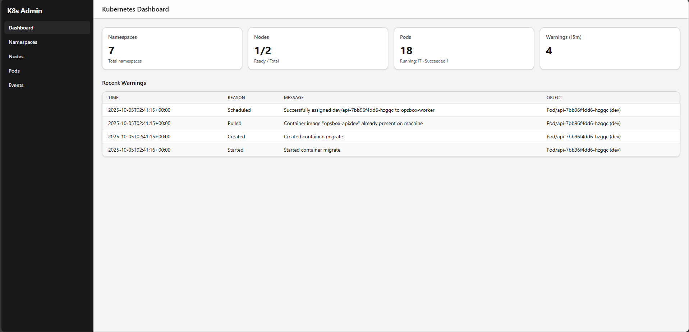

# OpsBox - All Devops in a Box
[](https://github.com/kieukhang185/opsbox/actions/workflows/ci.yaml)
[](https://github.com/kieukhang185/opsbox/actions/workflows/build-and-test.yaml)
[](https://github.com/kieukhang185/opsbox/actions/workflows/pre-commit.yaml)

The project is a small service with an API and worker, fully containerized and deployed on Kubernetes with all the trimmings: CI/CD, observability, security gates, and progressive delivery.

## System Overview

- **API**: FastAPI application
  - CRUD for `Task` resource
  - `/health` endpoint
  - `/metrics` Prometheus endpoint
  - `/tasks/{id}/run` enqueues background jobs
  - `/kubectl/*` k8s endpoint, get cluster metrics
- **Worker**: Python worker
  - Consumes jobs from RabbitMQ (Celery)
  - Simulates CPU/IO work
  - Scheduled hourly cleanup task
- **Web**: Vite + Typescripts + TailWindCSS
  - Visualize k8s metrics (own custom)
  - Show tasks (CRUD), run tasks
- **Database**: Postgres
  - Alembic migrations
- **Queue**: RabbitMQ (broker)
  - Celery tasks processed by worker
- **CLI**: Typer-based `opsbox`
  - Commands: build, push, deploy, smoke, logs, rollback
- **Bash scripts**: Developer automation
  - `bootstrap.sh`: install tools, create kind cluster, preload images
  - `teardown.sh`: remove ns objects and namespaces on cluster
- **Kubernetes**: Helm charts for API, worker, Postgres, RabbitMQ
  - Deployments/Rollouts
  - Services
  - ConfigMaps/Secrets
  - HPA
- **Observability**:
  - Prometheus scrape config
  - Grafana dashboards (latency, RPS, error rate, worker throughput)
- **Security**:
  - Secrets encrypted with `sops + age`
  - Image scanning with `trivy`
  - SBOM generation with `syft`
- **CI/CD**:
  - GitHub Actions workflows
  - PR pipeline: lint + test + scan
  - On merge: build & push images (`gitsha` + `latest`)
  - Deploy to kind with Helm, run smoke tests
  - Caching for ≤10min runtime
- **Progressive Delivery**:
  - Argo Rollouts for canary
  - Automated rollback on SLO breach

---

## Desired Outcomes

- **One-command dev up**: local cluster, DB/queue, API & worker running with `./ops/scripts/bootstrap.sh`
- **Green CI**: on every PR, pipeline completes stages with ≤10min runtime
- **Deploy on merge**: main branch deploys to local kind via GitHub Actions
- **Observability**: metrics scraped, dashboards show latency p50/p95, error rate; alert fires on >5% error for 5m
- **Safe releases**: canary auto-promotes on good metrics; auto-rolls back on failures
- **Security gates**: image scan blocks critical vulns; SBOM published; secrets encrypted at rest

---

## Getting Started

## Tools
|      Tools    |    Version    |      Tools    |    Version    |      Tools    |    Version    |
| ------------- | ------------- | ------------- | ------------- | ------------- | ------------- |
|    Python     |     3.12.3    |      Kind     |    v0.30.0    |      Sops     |    v3.10.2    |
|     Helm      |     3.17.4    |     Kubectl   |    v1.33.4    |       Age     |     v1.2.1    |

### Bootstrap (local dev)
```bash
./ops/scripts/bootstrap.sh
```
Runs lint → migrate → test → build → load → deploy → smoke in one shot.

### Teardown
```bash
./ops/scripts/teardown.sh         # remove workloads in dev ns
./ops/scripts/teardown.sh --cluster  # also delete kind cluster
```

### CLI
```bash
pip install -e tools/opsbox_cli
opsbox --help
```

### Setup python venv
```bash
sudo apt-get install python3.12-venv
python3 -m venv .venv
source .venv/bin/activate
```

### Pre-commit hooks
Install and enable once:

```bash
sudo apt install pre-commit
export PATH=$PATH:/home/ubuntu/.local/bin
pre-commit install
pre-commit run --all-files
```

---

### CI/CD Flow

- `build-and-test:` Build and Push API & Worker images to github registry (on push & pull-request main branch)
- `ci:` Basic ci flow to check API & Worker (on push dev branch)
- `pre-commit:` Synctax flow to check for Python, Bash, Yaml and so on (on push & pull-request main branch)

---

## Web Dashboard

<div align="center" width="100%">
  
  <br />K8s admin custom dashboard
</div>

---

## Observability

- **Prometheus** scrapes API `/metrics` (http_server metrics + counters) and worker metrics (jobs processed, latency, cleanups).
- **Grafana** dashboards show request rate, error rate, latency p50/p95, worker throughput/failures.
- **Alerting**: PrometheusRules trigger alerts on high error rate (>5% 5m) and job failures (>0 in 10m).
- **Loki + promtail**: centralized logs, correlated with trace IDs.

---

### Developer workflow

```bash
make help   # List all targets avaliable on Makefile
make build  # Build api/worker images
make deploy # Deploy all applivations (api, worker, postgres, rabbitmq,...)
make smoke  # Test api app `/health`
make down   # Uninstall Helm releases, delete namespace, kill port-forward
make clean  # Cleanup docker/docker images
make reset  # make down + make clean: Reset k8s
make nuke   # Destroy kind and cleanup
make prune  # Clean docker
```

---

## Security

- Secrets in git encrypted with `sops + age`.
- Images scanned in CI with Trivy (fail on CRITICAL).
- SBOM published with Syft.
- Optional Cosign signing/verification.

---

## Documentation & Runbooks

- **README.md** (this file): project overview and quickstart.
- **Runbooks**: Deploy, Rollback, On-call cheatsheet.
- **ADRs**: key choices (FastAPI, Celery vs RQ, Rollouts, sops).
- **Dashboards/alerts**: JSON and YAML committed under `ops/observability/`.

---

## License

This project is licensed under the MIT License.
